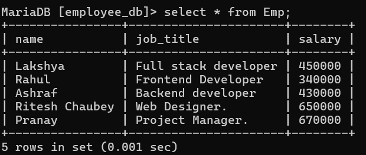

# 💼 Employee Management System

## 📖 Description
### The Employee Management System is a simple and responsive web-based application developed using PHP and MySQL. It allows users to perform basic CRUD (Create, Read, Update, Delete) operations on employee records. The system provides an easy interface to insert employee data, view records, update salary, and delete employees efficiently.

---

# 🛠️ Technology Used
- *HTML*
- *CSS*
- *PHP*
- *MySQL*
- *XAMPP*

---

## 🚀 Features
- ➕ *Insert Employee Data*
- 📄 *View Employee Records*
- ✏️ *Update Employee Salary*
- ❌ *Delete Employee Data*
- 🔐 *Secure Database using Prepared Statements*

---

## 📂 Project Structure
- `db.php`
- `insert.php`
- `show.php`
- `update.php`
- `delete.php`

---

## ⚙️ Setup Instructions

### 1. Install XAMPP
- Start *Apache*
- Start *MySQL*

### 2. Create Database
 
 ```sql
   create database employee_db;   
   ```

   ### 3. use Database
 
 ```sql
   use employee_db;   
   ```
   ### 4. Create Table
 
 ```sql
   create table emp_register(name varchar(30),job_title(30),salary double);
   ```

   ## ▶️ 💠 Insert Page
<p align="center">  </p>
<p align="center">  </p>


------------------------------------------------------------

 ## ▶️ 💠 Update Page
<p align="center">  </p>
<p align="center">  </p>


-----------------------------------------------------------------------

 ## ▶️ 💠 Delete Page
<p align="center">  </p>
<p align="center">  </p>


-------------------------------------------------------------
## ▶️ 💠 Show Page
<p align="center">  </p>

---------------------------------------------